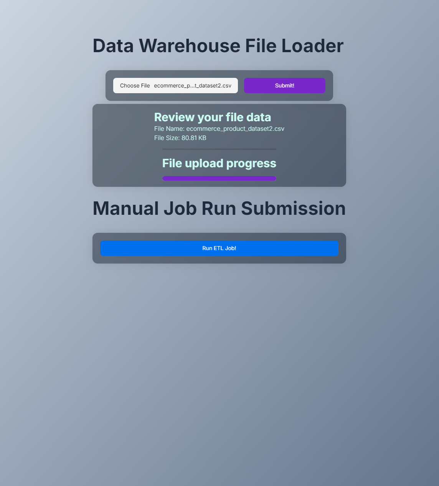
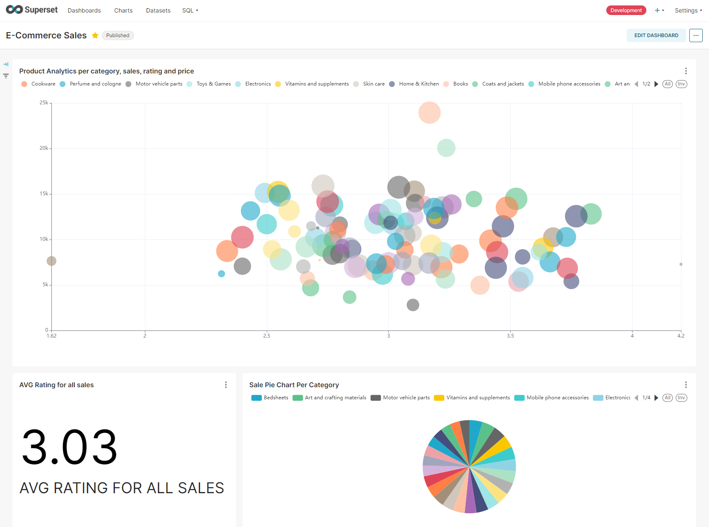

# Apache Superset Workflow Demo V1

```
Author(s):      Alejandro Araya Jiménez, Jeremy Quirós Marín, Ricardo Artavia Solano, Sebastián Acuña Pérez
Date Created:   2024-08-17
Date Updated:   2024-08-19
License:        Apache 2.0
```

---

## Introduction

This repository assumes you have `Docker`, `Docker-compose`, `Java` and `Node` installed in your local environment.

## Superset Installation

Please check this [Quickstart Guide](https://superset.apache.org/docs/quickstart/) from Apache Superset!
> This repository already ignores `superset` clones

```shell
$ git clone https://github.com/apache/superset
$ cd superset
$ docker compose -f docker-compose-image-tag.yml up
```

> This code block works for both PowerShell and Unix-like shells

---

# Project Overview

This project is an integrated data processing and web application stack utilizing various services and technologies. The primary goal is to
build a robust infrastructure that encompasses backend data warehousing with MongoDB and PostgreSQL, an ETL (Extract, Transform, Load)
scheduler, and a frontend application using Next.js, all orchestrated through Docker Compose.

## Key Components

### 1. MongoDB Service

- **Container Name**: `mongodb`
- **Image**: `mongo`
- **Environment**: Root user credentials for MongoDB.
- **Purpose**: Acts as the primary NoSQL database for storing unstructured or semi-structured data.

### 2. PostgreSQL Service

- **Container Name**: `postgres_db_dw`
- **Image**: `postgres`
- **Environment**: Database user, password, and default database configuration.
- **Purpose**: Acts as the relational database and data warehouse for structured data.

### 3. Spring-Based Data Warehouse Service

- **Service Name**: `mongodb-csv-data-warehouse`
- **Environment**: Connects to MongoDB for data processing.
- **Purpose**: A service designed to export data from MongoDB to CSV files or other formats for data warehousing needs.

### 4. ETL Scheduler Service

- **Service Name**: `postgresql-etl-scheduler`
- **Environment**: Connects to both MongoDB and PostgreSQL.
- **Purpose**: Orchestrates ETL processes, extracting data from MongoDB, transforming it, and loading it into PostgreSQL.

### 5. Next.js Frontend Application

- **Service Name**: `nextjs-app`
- **Environment**: Configured for production with environment variables for API connections.
- **Purpose**: Serves a modern web application for user interaction, showcasing processed data and providing a UI for various operations.

## Features

- **Network Configuration**: All services are connected on a custom bridge network (`superset-demo-net`).
- **Data Persistence**: Utilizes Docker volumes for persisting PostgreSQL data (`postgres-data`).
- **Health Checks**: Ensures MongoDB is healthy before dependent services start.
- **Modularity**: Uses multi-stage Docker builds and Compose overrides to separate configurations for development and production
  environments.
- **Environment Variables**: Securely manages configuration through environment variables for database connections and service settings.

## Deployment

The project uses `docker-compose` for easy orchestration and management of services. To run the project, execute:

```sh
docker-compose up --build
```

This command will set up the entire stack, automate dependencies, and ensure that all services are up and running in the correct order.


> This setup is ideal for a comprehensive application that requires seamless interaction between data storage, processing, and presentation
> layers, all contained within isolated, Docker-managed environments.

---

## Annex

### Images





### Links

- [Superset: Docker Installation](https://superset.apache.org/docs/installation/docker-compose/)
- [Kaggle: Exploring E-commerce Trends](https://www.kaggle.com/datasets/muhammadroshaanriaz/e-commerce-trends-a-guide-to-leveraging-dataset/data)